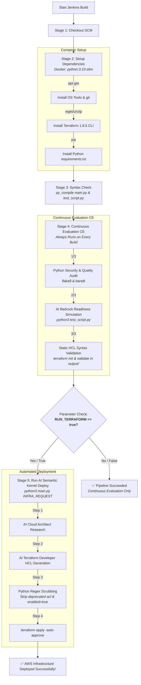

# 🚀 Semantic Kernel AWS Infrastructure Deployer: Jenkins Pipeline Architecture & Flow

This document provides a comprehensive architectural overview and execution flow of the **AI-Driven Infrastructure Deployer Pipeline** (`Jenkinsfile`). The pipeline leverages **Microsoft Semantic Kernel**, **Amazon Bedrock (Nova Pro AI)**, and **Terraform** within an isolated Docker environment to continuously evaluate, generate, and deploy AWS infrastructure from natural language prompts.

---

## 📊 End-to-End Pipeline Workflow

---

## 🛠️ Stage-by-Stage Breakdown

### 1️⃣ Stage: Checkout
* **Action:** Retrieves the latest application source code (`main.py`, `test_script.py`, `Jenkinsfile`, etc.) from the Git repository.
* **Environment:** Runs natively on the Jenkins agent before switching into the containerized execution environment.

### 2️⃣ Stage: Setup Dependencies
* **Action:** Provisions the execution environment inside an isolated Docker container (`python:3.10-slim` running as `root`).
* **Key Tasks:**
  1. Installs core Linux utilities (`wget`, `unzip`, `git`).
  2. Downloads, extracts, and installs the **HashiCorp Terraform CLI (v1.8.5)** into `/usr/local/bin/`.
  3. Upgrades Python `pip` and installs required SDKs from `requirements.txt` (`semantic-kernel`, `boto3`, `python-dotenv`).

### 3️⃣ Stage: Syntax Check
* **Action:** Compiles the primary Python scripts (`main.py` and `test_script.py`) to bytecode using `python3 -m py_compile`.
* **Purpose:** Acts as a rapid fail-fast mechanism to catch syntax typos or indentation errors before invoking external AI services or cloud APIs.

---

### 4️⃣ Stage: Continuous Evaluation (CE) 🟢 *[NEW & OPTIMIZED]*
* **Action:** Executes an automated, zero-risk Quality, Security, and Readiness audit.
* **Execution Rule:** **Always runs on every build**, regardless of whether deployment is requested. This ensures CI/CD visibility on pull requests and standard code commits without modifying AWS resources.

#### The 3 Pillars of Continuous Evaluation:
1. **🛡️ Python Security & Quality Audit (`flake8` & `bandit`):**
   * Dynamically installs `flake8` and `bandit`.
   * **`flake8`** scans project files for fatal Python syntax/logic errors (`E9, F63, F7, F82`), explicitly excluding virtual environments (`venv/`) to avoid false alarms from third-party libraries.
   * **`bandit`** scans `main.py` and `test_script.py` for Python security vulnerabilities (such as hardcoded secrets, unsafe `eval()` executions, or shell injection risks).
2. **🤖 AI Model Readiness & HCL Simulation (`test_script.py`):**
   * Connects to AWS Bedrock (`apac.amazon.nova-pro-v1:0`) using Jenkins EC2 IAM credentials.
   * Sends a test infrastructure prompt (*"Create an S3 bucket..."*) to verify that the LLM is responding and capable of generating valid HCL syntax.
   * Saves the simulated code to `output/main.tf` **without executing `terraform apply`**.
3. **🔍 Static Terraform HCL Validation (`terraform validate`):**
   * Navigates into the simulated `output/` directory.
   * Dynamically creates a minimal AWS provider configuration (`provider.tf`) using bulletproof line-by-line `echo` statements to prevent quote escaping or HCL single-line syntax errors.
   * Runs `terraform init -backend=false` and `terraform validate` to statically prove that the AI-generated HCL code is 100% syntactically valid before real deployment.

---

### 5️⃣ Stage: Run AI Semantic Kernel (Deploy) 🚀
* **Action:** Executes the full AI infrastructure generation and automated AWS provisioning workflow.
* **Execution Rule:** **Conditional Stage** — ONLY executes when the user explicitly checks the **`RUN_TERRAFORM`** parameter checkbox in the Jenkins UI.

#### What Happens inside `main.py`:
1. **AI Research Phase (`AWSOpsPlugin - ResearchTopic`):** The Bedrock Nova Pro AI acts as an AWS Cloud Architect, analyzing the user's natural language request (`INFRA_REQUEST`) and formulating an architectural plan.
2. **AI Code Generation Phase (`AWSOpsPlugin - GenerateTerraform`):** The AI acts as a Terraform Developer, converting the research plan into modern Terraform HCL code.
3. **Automated Code Scrubbing (`TerraformDeploymentPlugin`):**
   * **ACL Scrubber:** Forcibly deletes any hallucinated `acl = "..."` attributes from S3 buckets (preventing AWS Provider v5 `403 Forbidden` API crashes and infinite creation hangs).
   * **Lifecycle Scrubber:** Forcibly deletes any invalid `enabled = true/false` arguments inside lifecycle rules, replacing them with valid AWS Provider v5 syntax.
4. **Automated Deployment:**
   * Writes the cleaned code to `output/main.tf` alongside a global AWS provider configuration.
   * Executes `terraform init` followed by `terraform apply -auto-approve`.
   * Provisions the real physical AWS resources in region `ap-south-1`.

---

## 🎛️ Jenkins Pipeline Parameters

When triggering a build via **"Build with Parameters"** in Jenkins, you can configure:

| Parameter Name | Type | Default Value | Description |
| :--- | :---: | :--- | :--- |
| **`INFRA_REQUEST`** | `string` | `"Create an S3 bucket named rca-langgraph-sample-bucket"` | The natural language instruction describing the AWS infrastructure you want the AI to build. |
| **`RUN_TERRAFORM`** | `boolean` | `false` | **Unchecked (`false`):** Runs CE validation only. **Checked (`true`):** Runs CE validation AND executes `terraform apply` against live AWS infrastructure. |

---

## 🛡️ Built-in Safeguards & Architectural Highlights

1. **Dockerized Agent Isolation:** By executing inside `docker { image 'python:3.10-slim' }`, the build environment is completely ephemeral and reproducible. No system-level dependencies pollute the underlying Jenkins host server.
2. **IAM Role Integration:** The container inherits AWS credentials directly from the Jenkins EC2 IAM Role. No static AWS Access Keys or Secret Keys are stored in environment variables, code, or Jenkins secrets.
3. **Defensive AI Engineering:** Because LLMs are trained on millions of legacy repositories, they frequently generate deprecated Terraform v3/v4 syntax. Our hybrid architecture combines LLM prompt engineering with deterministic Python regex scrubbers to guarantee compatibility with AWS Provider v5.
4. **Separation of Concerns:** By isolating Continuous Evaluation (CE) from Deployment, developers can continuously test AI prompt behavior and code quality on every git push without risking unintended cloud expenditure or infrastructure modifications.
